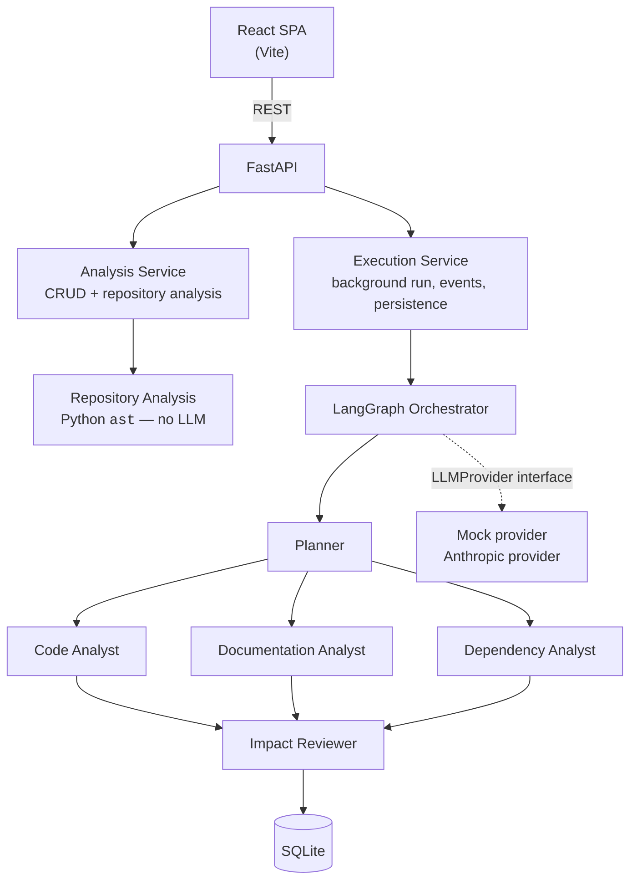

# DesignSync AI

**AI-powered software change impact analysis.**

You changed one file. What else did you just break?

DesignSync AI takes a plain-language description of a software change plus a
repository, and returns a structured impact report: which components are
affected, which documentation has gone stale, which tests need writing, and
what to do about it — with every finding tied back to evidence.

Five specialised agents do the work, three of them concurrently.

```
Change description ──► Understand software ──► Analyze impact
                                                     │
                              Identify documentation drift
                                                     │
                                          Recommend actions
```

---

## Table of contents

1. [Product overview](#1-product-overview)
2. [The problem](#2-the-problem)
3. [Architecture](#3-architecture)
4. [Agent architecture](#4-agent-architecture)
5. [Why the agents run in parallel](#5-why-the-agents-run-in-parallel)
6. [Repository analysis](#6-repository-analysis)
7. [API architecture](#7-api-architecture)
8. [Observability](#8-observability)
9. [Mock LLM mode](#9-mock-llm-mode)
10. [Demo workflow](#10-demo-workflow)
11. [Local setup](#11-local-setup)
12. [Running tests](#12-running-tests)
13. [Deployment (Railway)](#13-deployment-railway)
14. [Design decisions](#14-design-decisions)
15. [Known limitations](#15-known-limitations)
16. [Future improvements](#16-future-improvements)
17. [Important files](#17-important-files)

---

## 1. Product overview

The user is a software engineer who has just made — or is reviewing — a change.
They describe it in one sentence and point at a repository. DesignSync AI
returns a **Software Change Impact Report**:

| Section | What it answers |
|---|---|
| Executive summary | What changed and how far it reaches |
| Impact map | The dependency tree rooted at the changed file |
| Affected components | Component · impact · severity · evidence · confidence |
| Documentation drift | Document · status · why it's stale · what to write instead |
| Recommended tests | Test · reason · component · priority |
| Engineering actions | An ordered checklist |
| Confidence & evidence | Findings split into **confirmed / likely / uncertain** |

That last section is the one that matters most. AI inference is never presented
as fact — a finding backed by a parsed import edge is labelled differently from
one the model merely inferred.

**This is not a chatbot,** and it is not "upload a document and ask questions".
It is a pipeline with a fixed shape and a structured artifact at the end.

---

## 2. The problem

A developer changes `pricing/discount.py`. The blast radius is not confined to
that file:

- **other modules** import it and inherit new behaviour silently
- **APIs** expose the old semantics to consumers
- **documentation** now describes something that is no longer true
- **tests** encode the old expectations — and may keep passing while being wrong
- **product knowledge** drifts away from the code

Finding all of that by hand is tedious and easy to get wrong. Grep finds
mentions, not meaning. An LLM alone hallucinates file names. DesignSync AI
combines the two: **deterministic parsing establishes the facts, and the agents
reason over those facts.**

---

## 3. Architecture



ASCII, for the same picture:

```
                         React UI
                            |
                            | REST
                            v
                         FastAPI
                            |
              +-------------+-------------+
              |                           |
       Analysis Service            Execution Service
              |                           |
              +-------------+-------------+
                            v
                       LangGraph
                            |
                         Planner
                            |
          +-----------------+-----------------+
          |                 |                 |
     Code Analyst    Documentation      Dependency
                        Analyst           Analyst
          |                 |                 |
          +-----------------+-----------------+
                            |
                     Impact Reviewer
                            |
                          SQLite
```

**No business logic lives in React.** Components fetch JSON through a single
API client and render it. Orchestration, evidence gathering, scoring and
persistence are all server-side.

### Why Python / FastAPI for the backend

Every hard part of this system is a Python problem. Repository understanding is
`ast` — a standard-library module with no equivalent in the Node ecosystem for
Python source. Agent orchestration is LangGraph, whose primary implementation is
Python. Concurrency is `asyncio`, which FastAPI is built around natively so a
background workflow and the HTTP layer share one event loop. Pydantic then does
double duty: it validates HTTP requests *and* generates the JSON Schemas that
constrain the LLM's structured output, so one type definition serves both
boundaries.

---

## 4. Agent architecture

Five agents, each with a narrow role, a narrow prompt and its own output schema.

| # | Agent | Responsibility | Output contract |
|---|---|---|---|
| 1 | **Planner** | Turn the change description into an investigation plan. Scopes the work; does not analyse. | `change_summary`, `primary_area`, `investigation_targets[]`, `reasoning`, `confidence` |
| 2 | **Code Analyst** | Functions, classes, imports, callers, downstream modules, behaviour change. Separates `DIRECT` from `POTENTIAL_DOWNSTREAM`. | `affected_components[]`, `code_findings[]`, `potential_breakages[]`, `recommended_tests[]`, `confidence` |
| 3 | **Documentation Analyst** | Documentation the change has invalidated — quoting the offending sentence. | `documentation_findings[]`, `stale_documents[]`, `proposed_updates[]`, `confidence` |
| 4 | **Dependency Analyst** | Interpret the (deterministically parsed) import graph: direct vs transitive exposure, where risk concentrates. | `dependencies[]`, `affected_modules[]`, `dependency_risks[]`, `confidence` |
| 5 | **Impact Reviewer** | Consolidate, detect contradictions and unsupported claims, set overall severity, produce the action plan. | Full report + `confirmed/likely/uncertain` tiers |

### Why separate agents instead of one large prompt

One prompt asked to do five jobs does all five adequately and none well. Splitting them buys four concrete things:

- **Focus.** Each agent's system prompt describes one job, so instructions never compete for attention. The Documentation Analyst is told a document mentioning the area is not automatically stale — guidance that would be noise in a prompt also handling dependency analysis.
- **Enforceable contracts.** Five small schemas can each be validated. One schema covering everything is loose by necessity, and a malformed corner is hard to detect.
- **Independent failure.** A failed branch degrades the report instead of destroying it (see [failure handling](#failure-handling)).
- **Concurrency.** Independent jobs can overlap in time; one prompt cannot.

The cost is orchestration complexity and more total tokens. For this workload that is the right trade, because latency is dominated by the slowest branch rather than the sum.

### Failure handling

An agent failure is **contained, recorded and reported** — never swallowed.

| Failure | Behaviour |
|---|---|
| Planner fails | Falls back to a deterministic plan built from AST evidence; workflow continues; plan marked `degraded` |
| One analyst fails | Marked `FAILED` with its real error; other branches continue; **the reviewer is explicitly told which evidence is missing** |
| All analysts fail | Report still produced, confidence drops sharply, gaps listed as uncertain |
| Reviewer fails | Degraded report returned rather than a blank page |
| Malformed LLM JSON | Caught at the agent boundary and treated as a failure, never half-parsed into the report |

The reviewer's prompt names the failed agents and instructs it to mark the gap
explicitly. A partial picture is reported as partial:

> *"Consolidation is partial: Code Analyst did not return evidence, so gaps in
> those areas are unknown rather than absent."*

---

## 5. Why the agents run in parallel

The Code, Documentation and Dependency analysts consume the Planner's output and
**nothing from each other**. Serialising independent work is just latency.

They are placed in one LangGraph superstep, so the runtime dispatches them
together and awaits them concurrently. The reviewer's fan-in edges mean it is
not scheduled until all three finish — that barrier is enforced by the graph,
not by a sleep or by the UI pretending.

### Why the reviewer waits

It is a *synthesis and quality-control* stage. Its job includes detecting
contradictions between analysts and flagging claims one analyst made that
another's evidence does not support. Both are impossible without all three
inputs. Starting early would mean reviewing a partial picture while presenting
it as complete — precisely the failure mode the confidence tiers exist to
prevent.

### Measured, not claimed

Real numbers from the demo repository, same work both times, only the
concurrency limit changed:

| Concurrency limit | Actual | Est. sequential | Est. saved | Est. speedup |
|---|---|---|---|---|
| **3** (default) | **4.8s** | 8.9s | 4.1s | **1.86x** |
| **1** | **9.0s** | 8.9s | 0ms | **0.98x** |

The execution page renders a Gantt chart positioned by each agent's measured
start and end timestamps. At limit 3 the three analyst bars visibly overlap; at
limit 1 they step one after another. The concurrency limit is a real
`asyncio.Semaphore` bound on in-flight LLM requests, not a display setting.

Three tests assert this behaviour rather than trusting the graph definition:
execution intervals must genuinely intersect, wall clock must beat the sum of
agent durations, and a limit of 1 must produce non-overlapping intervals.

**On the arithmetic.** `duration_ms` is measured. Everything else is an
*estimate* and is labelled as such in the UI:

```
estimated sequential = sum(all agent durations)
estimated parallel   = planner + max(three branches) + reviewer
estimated saved      = sequential - actual
estimated speedup    = sequential / actual
```

The design spec predicted 8.9s / 4.7s / 4.2s / 1.89x from the simulated
latencies. The real run produced 8.9s / 4.8s / 4.1s / 1.86x — the gap is
orchestration and persistence overhead.

---

## 6. Repository analysis

**The whole system does not rest on LLM reasoning.** Before any agent runs, a
deterministic pass parses the repository with Python's `ast` module.

For every `.py` file it extracts modules, imports, functions, classes, methods
(with line numbers) and call references; for every `.md` file, headings and
content. It then builds an **import graph** and — crucially — its inverse.

That inverse is what turns *"which files call `discount.py`?"* from a question
into a fact:

```
pricing/discount.py  <-  pricing/pricing_service.py
                         checkout/service.py
                         api/pricing_api.py
                         tests/test_discount.py
                         tests/test_pricing_service.py
```

Only *internal* imports are kept — `dataclasses` says nothing about this
repository's blast radius.

A second deterministic pass scores files against the change description by
path, symbol name and documentation mentions, then pulls in downstream
importers. This gives the Planner concrete candidates and doubles as the
fallback plan if the Planner fails.

Every agent receives this evidence in a `<CONTEXT>` JSON block, so the model
spends its budget on *interpretation* rather than rediscovery — and cannot
invent a file that does not exist without contradicting its own context.

Syntax errors are recorded in `malformed_files` and skipped. One unparseable
file never aborts an analysis.

---

## 7. API architecture

| Method | Path | Purpose |
|---|---|---|
| `GET` | `/api/health` | Status + **which provider will actually serve requests** |
| `POST` | `/api/analyses` | Create an analysis (runs the deterministic pass) → `201` |
| `GET` | `/api/analyses` | List analyses |
| `GET` | `/api/analyses/{id}` | Full analysis + report + findings |
| `POST` | `/api/analyses/{id}/execute` | Start the workflow → `202` + `execution_id` |
| `GET` | `/api/executions/{id}` | Status + metrics + agent records |
| `GET` | `/api/executions/{id}/events?after_seq=N` | Ordered progress events |
| `GET` | `/api/executions/{id}/agents` | Full per-agent observability |
| `GET` | `/api/demo-repository` | Bundled sample repo + default change |
| `POST` | `/api/repositories/upload` | Upload a repository ZIP |
| `GET` | `/api/dashboard/stats` | Dashboard aggregates |

Every request and response is a Pydantic model. Validation failures return
`422`, unknown resources `404`, a re-run of a running analysis `409`. A global
exception handler returns `{"detail": "..."}` — **an internal traceback is never
exposed to a client**.

`execute` returns immediately and the workflow runs as an `asyncio` task, so a
long analysis never holds an HTTP request open.

**Progress uses polling, not SSE.** The event log is persisted with sequence
numbers and the client polls with the last sequence it saw. This survives a page
refresh, is trivially testable, and is immune to proxy buffering on the
deployment platform. The cost is up to 500 ms of latency, which is invisible at
demo timescales.

---

## 8. Observability

Every agent execution records:

```
agent · status · start · end · duration_ms
prompt_tokens · completion_tokens · total_tokens · estimated_cost
model · provider · confidence
system prompt · user prompt · structured output · error
```

All of it is exposed through `/api/executions/{id}/agents` and rendered in an
expandable panel per agent on both the execution and report pages.

Cost is computed from a per-model price table (Opus 5 at $5/$25 per MTok,
Sonnet 5 at $3/$15, Haiku 4.5 at $1/$5). Mock mode uses the same table so
simulated runs still show realistic spend.

**What is deliberately not shown:** model chain-of-thought. It is never
requested, never stored, never displayed. The `reasoning` field visible in the
Planner panel is an intentional output field of that agent's schema — a summary
the agent was asked to produce — not hidden reasoning.

Secrets are never logged and never serialised. `/api/health` reports the
provider *name*, never the key.

---

## 9. Mock LLM mode

With `LLM_PROVIDER=mock` — or simply no credentials configured for whichever
provider is selected — the entire application runs **offline**, with no API key
and no network, while exercising the real path end to end:

```
API → orchestration → agents → reviewer → persistence → UI
```

The mock is **not a canned report**. It parses the same `<CONTEXT>` evidence
envelope the real model receives and derives every finding from the actual
repository: real paths, the real import graph, real symbol names, real
documentation excerpts. It also parses `"changed X from A to B"` out of the
change description to know which behaviour is being replaced — which is how it
identifies precisely which documentation sentences are now stale.

Point it at a different repository and the findings change accordingly. A test
asserts exactly this: analysing a synthetic billing repo yields
`billing/invoice.py` and never mentions `pricing/discount.py`.

It also simulates what a real call costs: per-agent latency (`asyncio.sleep`),
token counts derived from prompt size, and dollar cost from the same price
table. Outputs are validated against the same Pydantic schemas the real
provider is held to.

### Provider abstraction

```python
class LLMProvider(ABC):
    def is_available(self) -> bool: ...
    async def complete(self, *, system_prompt, user_prompt,
                       response_schema, agent_name) -> LLMResponse: ...
```

**Four providers behind one interface — three real, one mock.** Pick one with
`LLM_PROVIDER` in `.env`:

| `LLM_PROVIDER` | Provider | Default model | Auth |
|---|---|---|---|
| **`vertex`** *(default)* | Google Vertex AI | `gemini-3.6-flash` | **Application Default Credentials — no API key** |
| `anthropic` | Anthropic | `claude-opus-5` | `ANTHROPIC_API_KEY` |
| `openai` | OpenAI | `gpt-5.6-terra` | `OPENAI_API_KEY` |
| `mock` | Deterministic mock | `mock-designsync-1` | none |

Vertex AI is the odd one out and deliberately so: it takes **no API key**.
Credentials come from ADC — `gcloud auth application-default login` locally, or
the attached service account on Google Cloud. `GOOGLE_CLOUD_PROJECT` is what
marks it configured.

**No agent imports a vendor SDK.** The three provider modules under `app/llm/`
are the only files that do, and each imports its SDK *lazily*, so a missing
optional dependency degrades that one provider instead of breaking startup.
Agents depend only on the interface, so provider choice is a factory decision —
adding a fifth provider means one new file and one registry entry, with zero
changes to any agent.

The rule that makes a fresh clone work with an empty `.env`:

> A provider is used only if `is_available()` returns true; otherwise the
> request falls back to the mock.

This is why the default can be Vertex AI *and* the app still runs offline out of
the box: with no GCP project set, Vertex reports itself unconfigured and the
mock takes over. `/api/health` and the startup log both report the provider that
**actually** ran, so the substitution is never a silent surprise.

`is_available()` reports *configured*, not *credentials valid*. A wrong key or
an expired ADC session fails loudly at call time — recorded as an agent failure
with the real error — rather than silently fabricating an answer.

Each real provider enforces structured output through its own API — Vertex via
`response_schema`, Anthropic via `output_config.format`, OpenAI via a strict
`json_schema` — and re-validates locally.
Defence in depth: `run_agent` validates a third time, so no provider — present
or future — can put a schema-invalid payload into a report.

---

## 10. Demo workflow

A 4–5 minute walkthrough:

1. **Overview** — empty state, honest about having no data yet
2. **New Analysis** → **Load Demo Repository** — the change description
   auto-fills; the banner shows `11 files · 8 modules · 3 docs · 2 test files`,
   already parsed
3. **Analyze Change** → the execution page
4. **Planner** turns `SUCCESS`
5. **All three analysts turn `RUNNING` simultaneously** while the **Impact
   Reviewer stays `WAITING`** ← the core engineering claim, visible
6. Reviewer runs once they all finish
7. **Metrics**: 4.8s actual vs 8.9s estimated sequential → **1.86x**
8. **Timeline**: three overlapping bars
9. **Impact Report**: HIGH · 6 components · 3 documents · 3 test areas
10. **Documentation drift**: `docs/pricing.md`, `docs/API_REFERENCE.md` and
    `README.md` all flagged STALE, each quoting the offending sentence
11. **Confidence & evidence**: 9 confirmed findings, each citing a verified
    import edge
12. **Expand an agent panel** for tokens, cost, prompts and structured output
13. *(optional)* Re-run with **concurrency limit 1** — identical findings,
    9.0s, **0.98x**. Proof the parallelism is real.

The demo needs no configuration and no credentials.

### The demo repository

A small Python commerce backend under `backend/app/demo_repository/`:

```
pricing/discount.py          <- the change lands here
pricing/pricing_service.py   <- imports discount
checkout/service.py          <- imports pricing_service
api/pricing_api.py           <- imports both
tests/test_*.py              <- encode the old behaviour
docs/pricing.md              <- describes purchase-history discounting
docs/API_REFERENCE.md        <- documents "basis": "purchase_history"
README.md
```

Discounts are computed from **purchase history**, and the documentation says so
explicitly — which is what makes it provably stale once the change description
says the rule is now **customer-segment** based.

---

## 11. Local setup

**Prerequisites:** Python 3.11+ and Node 18+.

### Backend

```bash
python -m venv .venv
.venv\Scripts\activate          # Windows
# source .venv/bin/activate     # macOS / Linux

pip install -r backend/requirements.txt

cd backend
uvicorn app.main:app --reload --port 8000
```

→ http://localhost:8000 · docs at http://localhost:8000/docs

### Frontend

```bash
cd frontend
npm install
npm run dev
```

→ http://localhost:5173 (proxies `/api` to port 8000)

### Environment variables

Copy `.env.example` to `.env`. **Every value has a working default — an empty
`.env` runs the full application.**

| Variable | Default | Purpose |
|---|---|---|
| `LLM_PROVIDER` | `vertex` | `vertex` \| `anthropic` \| `openai` \| `mock` |
| `MOCK_LLM` | `false` | Force the mock regardless of `LLM_PROVIDER` |
| `GOOGLE_CLOUD_PROJECT` | *(unset)* | **Vertex AI — ADC, no API key.** Setting this marks Vertex configured |
| `GOOGLE_CLOUD_LOCATION` | `global` | Vertex AI region |
| `VERTEX_MODEL` | `gemini-3.6-flash` | Gemini model |
| `ANTHROPIC_API_KEY` | *(unset)* | Anthropic credentials |
| `LLM_MODEL` | `claude-opus-5` | Also `claude-sonnet-5`, `claude-haiku-4-5` |
| `OPENAI_API_KEY` | *(unset)* | OpenAI credentials |
| `OPENAI_MODEL` | `gpt-5.6-terra` | Also `gpt-5.6-sol`, `gpt-5.6-luna` |
| `DEFAULT_CONCURRENCY_LIMIT` | `3` | Max simultaneous LLM requests |
| `MOCK_LATENCY_SCALE` | `1.0` | Scales simulated latency (`0.1` for tests) |
| `DATABASE_URL` | `sqlite:///./designsync.db` | SQLite path |
| `CORS_ORIGINS` | `http://localhost:5173,...` | Dev only; same-origin in production |
| `UPLOAD_DIR` | `./data/uploads` | Extracted uploaded repositories |

To use a real provider:

```bash
# Google Vertex AI (default) — no API key, uses ADC
gcloud auth application-default login
# .env:
LLM_PROVIDER=vertex
GOOGLE_CLOUD_PROJECT=my-gcp-project

# Anthropic
LLM_PROVIDER=anthropic
ANTHROPIC_API_KEY=sk-ant-...

# OpenAI
LLM_PROVIDER=openai
OPENAI_API_KEY=sk-...
```

Selecting a provider you have not configured is not an error — it falls back to
the mock, and `/api/health` tells you that is what happened.

---

## 12. Running tests

```bash
cd backend
python -m pytest -q          # 174 tests, ~35s
python -m pytest -v          # verbose
```

Coverage by area:

| File | What it locks down |
|---|---|
| `test_repo_analysis.py` | Files, modules, imports, functions, classes, methods, markdown, tests, reverse import graph, malformed files, vendor-dir skipping, change targeting |
| `test_api.py` | Health, create (incl. `422` on empty/short input), get, `404`, list, execute→completion, metrics, events ordering + incremental fetch, agents endpoint, re-run without duplicate findings, dashboard |
| `test_orchestration.py` | Planner first · **intervals genuinely overlap** · wall clock beats the sum · reviewer waits for all three · limit 1 serialises · semaphore caps in-flight calls · findings identical across limits |
| `test_failures.py` | Agent failure marked + error preserved · workflow continues · reviewer told what's missing · report flags the gap · confidence drops · planner fallback · malformed JSON caught · reviewer failure degrades |
| `test_metrics.py` | The spec's worked example: 8.9 / 4.7 / 4.2 / **1.89** |
| `test_llm_mock.py` | Determinism · different repo ⇒ different findings · token/cost accounting · latency scaling · schema validation for all five agents · provider fallback |
| `test_llm_providers.py` | Per-provider availability · four-way `LLM_PROVIDER` selection + aliases · fallback to mock when unconfigured · force-mock precedence · Vertex and OpenAI driven through stubbed clients (request shape, structured-output config, usage, cost, truncation, refusal) · no credential ever appears in an error message |
| `test_security.py` | Zip-slip (relative, nested, absolute, drive, backslash) · symlinks · size and entry caps · **repository code is never executed or imported** · upload endpoint rejections |

`conftest.py` sets `MOCK_LATENCY_SCALE=0.1` so the suite runs in seconds while
leaving the simulated latencies large enough for overlap to remain measurable.

---

## 13. Deployment (Railway)

Built as **one service**: a multi-stage Dockerfile compiles the React bundle,
then FastAPI serves both the API and that bundle from the same origin (so CORS
is irrelevant in production).

1. Push the repository to GitHub
2. Railway → **New Project → Deploy from GitHub repo**
3. Railway reads `railway.json`, builds the `Dockerfile`, and health-checks
   `/api/health`
4. Set variables (optional — it runs with none):
   ```
   LLM_PROVIDER=mock
   ```
   For a real provider, set `LLM_PROVIDER` and its credentials — e.g.
   `LLM_PROVIDER=anthropic` + `ANTHROPIC_API_KEY=sk-ant-...`. Note that Vertex
   AI needs ADC, which is awkward on Railway; a key-based provider is the
   simpler choice there.

`$PORT` is honoured via the shell-form `CMD`. The image runs as a non-root user.

**Persistence:** the container filesystem is ephemeral, so analyses are lost on
redeploy. To keep them, mount a Railway volume at `/app/data` — the default
`DATABASE_URL` already points there.

Local production preview (no Docker required):

```bash
cd frontend && npm run build
cp -r dist ../backend/static
cd ../backend && uvicorn app.main:app --port 8000
# API and UI both on http://localhost:8000
```

---

## 14. Design decisions

**1. Deterministic parsing for repository structure, not an LLM.**
Which files exist and which modules import which are *parsing* problems, not
reasoning problems. Asking a model is slower, costlier and less reliable —
and it hallucinates paths. `ast` gives ground truth, which then becomes the
evidence the agents reason over. This is also what lets the report label a
finding **confirmed** rather than merely plausible.

**2. Multiple specialised agents instead of one large prompt.**
Focus, enforceable per-agent schemas, independent failure containment, and the
option to overlap independent work in time. Discussed in
[§4](#why-separate-agents-instead-of-one-large-prompt).

**3. Independent analysis agents run concurrently.**
They share no inputs, so serialising them is pure latency. Measured: 4.8s vs
9.0s on the demo repository. Bounded by a configurable semaphore so a fan-out
can never issue unlimited concurrent LLM requests.

**4. A final reviewer agent synthesises and quality-controls.**
Three analysts produce three partial views that can overlap or disagree. The
reviewer consolidates them, flags contradictions and unsupported claims, and —
most importantly — sorts findings into confirmed / likely / uncertain so
inference is never presented as fact.

**5. Structured JSON outputs, not free-form text.**
Every agent has a Pydantic output model. It is the JSON Schema handed to the
API *and* the validator applied to the response, so a malformed answer is a
caught error rather than a silently corrupt report. It is also what makes the
findings renderable as tables instead of prose.

**6. A deterministic MockLLM so the whole system is testable and demonstrable.**
Real LLM calls are non-deterministic, slow, cost money and need credentials —
all fatal for a test suite and awkward for a demo. The mock exercises every
layer while producing repository-grounded output, so `git clone && pytest`
works with no configuration and the demo runs on a plane.

**8. Provider choice is configuration, not code.**
Four providers sit behind one `LLMProvider` interface, chosen by a single
`LLM_PROVIDER` value. Each vendor SDK is imported lazily inside its own module,
so a missing optional dependency degrades one provider rather than breaking
startup. Because nothing in the agent layer knows a vendor exists, adding a
fifth provider is one new file plus one registry entry. The fallback-to-mock
rule is what lets the default be a credentialed provider (Vertex AI) while a
fresh clone still runs offline — the substitution is reported by `/api/health`
rather than hidden.

**7. Uploaded repositories are untrusted text and are never executed.**
Files are read as text and parsed with `ast.parse`. Nothing is imported, no
setup script runs, no code is evaluated. Archive extraction validates every
member before writing a byte (traversal, symlinks, size and entry caps). Two
tests prove the guarantee: a file with a destructive import-time side effect
stays inert, and nothing from an analysed repository ever appears in
`sys.modules`.

---

## 15. Known limitations

- **Python only.** The AST analysis is Python-specific. Other languages are
  detected as files but produce no import graph, so uploads without Python
  modules are rejected with a clear message.
- **Mock findings are template-shaped.** They are genuinely derived from the
  repository — real paths, real graph, real doc sentences — but their phrasing
  follows fixed patterns. A real model produces more varied prose.
- **SQLite is ephemeral on Railway** unless a volume is mounted.
- **Polling, not streaming.** Up to ~500 ms of progress latency.
- **Whole-repository analysis.** No incremental or diff-based mode, and no
  chunking strategy for very large repositories — a huge repo would produce a
  large prompt.
- **No git integration.** The change is described in prose; the tool does not
  read an actual diff, so it reasons about what you *say* changed.
- **Live provider calls are unverified.** Vertex AI and OpenAI are implemented
  and unit-tested against stubbed clients, but no real request has been made
  from this machine (no GCP project, no OpenAI key). Anthropic is likewise
  untested against the live API. Only the mock path is verified end to end.
- **Import-level dependencies.** Call-graph analysis is best-effort; dynamic
  imports, reflection and runtime dispatch are invisible to static parsing.
- **No auth.** Anyone who can reach the deployment can use it.

---

## 16. Future improvements

- Git integration: analyse a real diff, PR or commit range instead of prose
- SSE or WebSocket progress in place of polling
- Multi-language support (TypeScript, Go, Java) via tree-sitter
- Incremental analysis and caching for large repositories
- Per-analysis provider choice in the UI (currently `.env`-wide)
- Proposed documentation patches as reviewable diffs
- Postgres for durable multi-user history
- Auth and per-user history

Explicitly **not** implemented, per scope: GitHub/GitLab integration, PR
automation, automatic code or documentation commits, user accounts, team
management, vector database / RAG, chat assistant, autonomous coding agent.

---

## 17. Important files

**The parts worth reading first are marked ★.**

```
backend/app/
  services/repo_analysis.py      ★ AST parsing → RepositorySummary + import graph
  services/change_targeting.py     deterministic change → candidate files
  orchestrator/graph.py          ★ LangGraph fan-out / fan-in workflow
  orchestrator/state.py            reducers that let branches merge safely
  agents/base.py                 ★ run_agent: concurrency, timing, failure containment
  agents/outputs.py                the five output contracts
  agents/prompts.py                system prompts + evidence envelopes
  agents/{planner,code_analyst,docs_analyst,
          dependency_analyst,impact_reviewer}.py
  llm/base.py                    ★ the LLMProvider interface
  llm/mock_provider.py           ★ deterministic, repository-grounded agents
  llm/vertex_provider.py           Google Vertex AI (Gemini), ADC — the default
  llm/anthropic_provider.py        Anthropic (Claude)
  llm/openai_provider.py           OpenAI (GPT)
  llm/factory.py                 ★ four-way selection + fallback rule
  services/metrics.py            ★ the speedup arithmetic
  services/execution_service.py    background run, events, persistence
  services/zip_repository.py     ★ safe extraction of untrusted archives
  api/                             health, analyses, executions, repositories, dashboard
  models.py                        six SQLAlchemy tables
  demo_repository/                 the bundled sample repo

backend/tests/                     174 tests
  test_orchestration.py          ★ proves the concurrency claim
  test_security.py               ★ proves uploaded code is never executed

frontend/src/
  api/client.js                    the only place the UI talks to the backend
  pages/{Overview,NewAnalysis,Execution,Result,Analyses}.jsx
  components/AgentGraph.jsx        the five-node workflow view
  components/ExecutionTimeline.jsx ★ the Gantt that proves overlap
  components/AgentDetails.jsx      per-agent observability panel
  components/ImpactMap.jsx         dependency tree from the real import graph

Dockerfile · railway.json · .env.example
```

---

## Quick reference

```bash
# Backend
cd backend && uvicorn app.main:app --reload --port 8000

# Frontend
cd frontend && npm run dev

# Tests
cd backend && python -m pytest -q
```

Runs offline with an empty `.env`.
